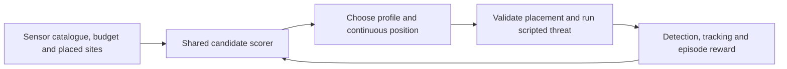

# Blue Team RL: dynamic sensor placement

Blue learns **which sensor profile to deploy and where to place it** around a
synthetic objective. It supports passive RF, search radar, electro-optical,
thermal, and combined radar/thermal profiles, including repeated deployments
of the same profile within the available budget.

**New: randomized adaptive training.** Start with the
[adaptive guide](ADAPTIVE.md) for scenario-conditioned sensor/site choices,
an offline replay demo, external-format sensor inputs, and held-out comparisons
against the original checkpoint and non-RL methods. The adaptive experiment
is separate from the historical live Unreal experiment documented below.

The follow-on [robust curriculum experiment](ROBUST.md) adds varying sensor
capabilities and severe cases. Its [v2 candidate](ROBUST_RESULTS.md) has modest
validation gains but an unresolved stopping/resource-use gap; it is not a
final-tested robustness release.

The additive [balanced deployment experiment](BALANCED.md) tests a learned
deploy-or-stop gate to address that gap, with an explicitly versioned actor,
matched initialized controls and unchanged simulation physics/rewards.
Its [v3 results and offline demo](BALANCED_RESULTS.md) document 24,000 further
training episodes and the measured cost/detection tradeoff; it remains an
experimental candidate, not a final-tested replacement.

This package publishes the Python trainer, a trained checkpoint, recorded
results, and selected native source from the TRIAD experiment. You can run the
Python example immediately. Live Unreal training requires the original TRIAD
host and its dependencies; the package is not connected to Istana Open's Red
Team Manager or its schema-1 policy interface yet. See
[integration status](INTEGRATION.md).

## Try it without Unreal

Requires Python 3.11 or later. Run these PowerShell commands from the repository
root:

```powershell
py -3.11 -m venv .\RL\BlueTeam\.venv
.\RL\BlueTeam\.venv\Scripts\python.exe -m pip install -e ".\RL\BlueTeam\Python[test]"
.\RL\BlueTeam\.venv\Scripts\python.exe -m pytest -q .\RL\BlueTeam\Python\tests
.\RL\BlueTeam\.venv\Scripts\python.exe .\RL\BlueTeam\Python\train_blue_placement.py `
  --dry-run --episodes 40 --batch-size 10 --seed 1337 `
  --checkpoint-dir .\Saved\BlueRL\dry-run
```

The run prints episode metrics and saves `episode_000040_final/checkpoint.json`,
`arrays.npz`, and `training_metrics.jsonl` beneath `Saved/BlueRL/dry-run`.
Evaluate that newly trained example on a separate seed range:

```powershell
.\RL\BlueTeam\.venv\Scripts\python.exe .\RL\BlueTeam\Python\evaluate_checkpoint.py `
  --dry-run --checkpoint .\Saved\BlueRL\dry-run\episode_000040_final `
  --episodes 20 --seed 1500000000 --output .\Saved\BlueRL\dry-run-evaluation
```

Use a fresh output directory for each evaluation. On macOS/Linux, use
`python3 -m venv RL/BlueTeam/.venv` and `RL/BlueTeam/.venv/bin/python` with `/`
path separators.
The trainer runs on CPU with NumPy, Gymnasium, and PettingZoo; no GPU, PyTorch,
or Ray is required.

The dry-run environment is a small Python exercise for policy updates, action
masks, metrics, and checkpoint loading. Its observations and sensor behavior
differ from the Unreal experiment. **The bundled `Checkpoints/toy-210`
checkpoint cannot be used with `--dry-run`**: it has a different feature
contract and is intentionally rejected.

## How placement works



A Blue action contains a catalogue index and normalized East/North position.
The final catalogue index commits the layout. Dynamic placement is constrained
by objective standoff, terrain, site separation, site count, and cost; Unreal
makes the final decision about legality in live mode.

The policy scores each catalogue row with shared weights and pools existing
placements. Adding profiles does not require resizing the network, provided
the named observation features remain compatible. Live candidates are defined
in [DefaultTrainingConfig.json](DefaultTrainingConfig.json). Each has a stable
`SensorProfileId`, capability settings, cost, and `bAllowDynamicPosition`.
Changed configurations need their own training and evaluation; architectural
compatibility does not establish performance on unseen sensors.

Red follows a fixed or seeded script. Blue chooses the layout before Red
deployment; this version does not relocate sensors during an episode or train
a second Red policy. `train_self_play.py` is a compatibility entry point to the
same Blue trainer.

## Published experiment

The included checkpoint completed 210 live Unreal episodes on 10 September
2026. In 50 evaluation episodes, its sampled policy achieved **72% abstract
defence**, compared with **56%** for the initialized sampled baseline.
Deterministic deployment achieved 50/50 in the same fixed scenario.

These runs use one drone approaching from the north in a generic flat arena,
with analytical sensor models. They demonstrate learning in that experiment;
the seed changes do not make them 50 different threat scenarios. See
[results and limitations](RESULTS.md) for the evidence and interpretation.

| Included | Purpose |
| --- | --- |
| [Python/](Python/) | Policy, live bridge, training/evaluation commands, and tests |
| [ADAPTIVE.md](ADAPTIVE.md) | Randomized trainer, trained adaptive checkpoint, offline demo and benchmark commands |
| [ADAPTIVE_INPUTS.md](ADAPTIVE_INPUTS.md) | Shared simulated/external sensor input contract and recommendation API |
| [Examples/](Examples/) | Public observation and interchangeable sensor catalogue examples |
| [DefaultTrainingConfig.json](DefaultTrainingConfig.json) | Version-4 live scenario and five sensor profiles |
| [Checkpoints/toy-210/](Checkpoints/toy-210/) | Live-trained policy, optimizer and random-generator state |
| [Results/](Results/) | Training history, three evaluation reports, and native oracle |
| [NativeReference/](NativeReference/) | Selected TRIAD native RL sources for integration work |

For live host requirements, training commands, and the work needed to connect
this package to Istana Open, continue with [INTEGRATION.md](INTEGRATION.md).
